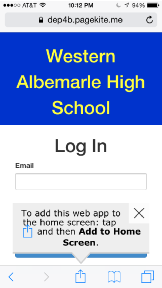
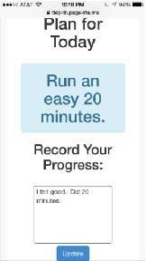
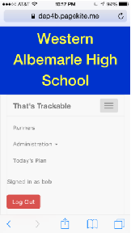

# Welcome to RunTracker!

RunTracker let's you see your running schedule for the whole summer, and track your progress.   If you  and your coach customize your schedule from the defaults, then that is done here as well.   At the end of the summer you'll be able to see how much you have improved!

RunTracker is a brand new website, meant to be used through your phone.   Since it is brand new, please bear with us if there are any glitches.  Problems?  Ideas for improvements (like text me when I should bring my yoga mat!), please let Coach Katie know.

# How to Use The App

## Step 1
Just open up http://runtracker.bananapatchmumble.org.  You can use your phone or computer.

## Step 2
You will be prompted to login using your email address and a password.  Ask Coach Katie for details.

You may be prompted to add the app to your phone as an "app".

## Step 3
The landing page is your **Today** view.  It will show you what your plan is for the day, and give you a space to put in what you did, and how you felt.  Then click *Update* to save your input.

## Step 4
There are some other functions you can do, like look at your other runs.  On a computer, you use the nav bar at the top of the page, on your phone you access the nav bar options through what we call the **Hamburger**, the 3 horizontal lines.

